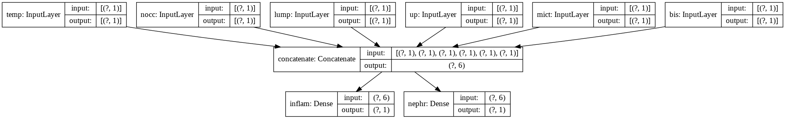
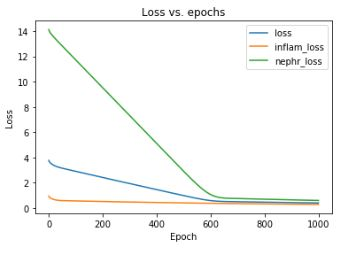
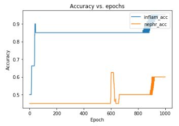
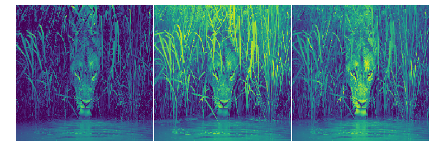
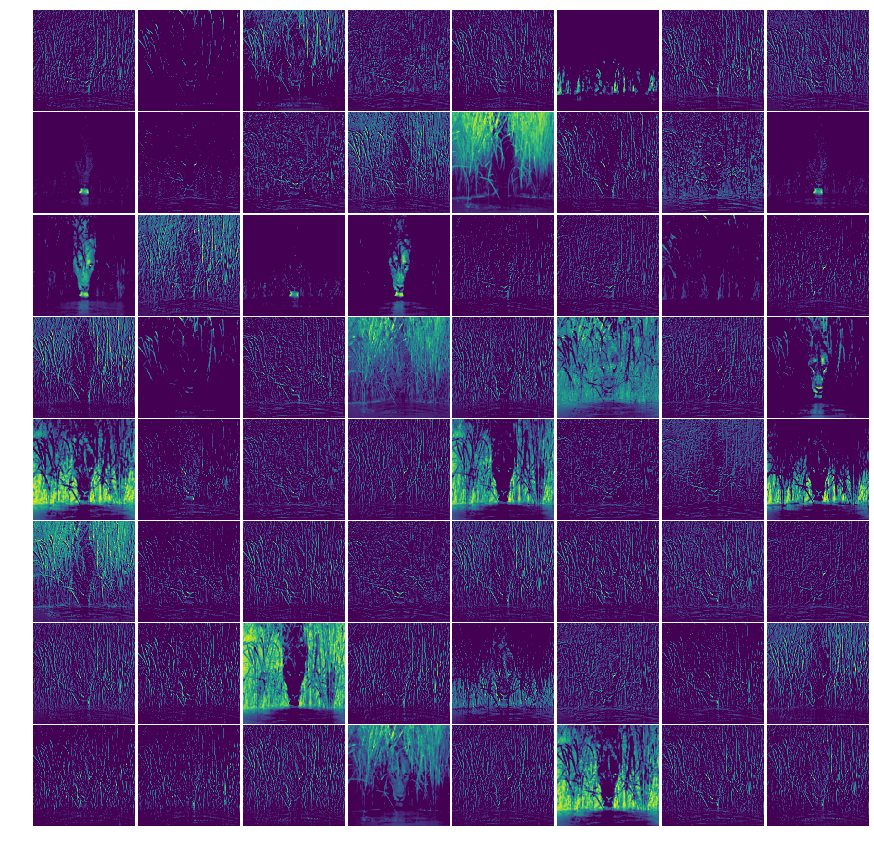
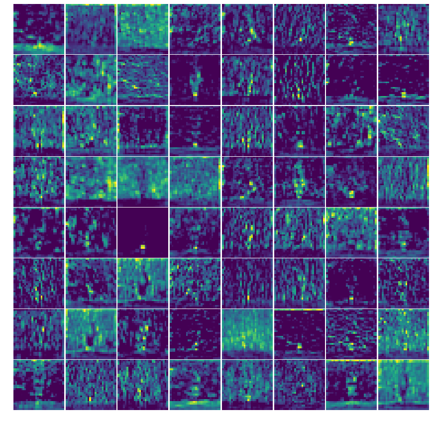
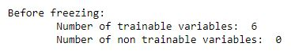
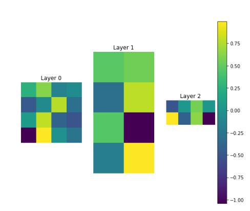
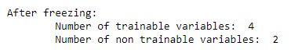
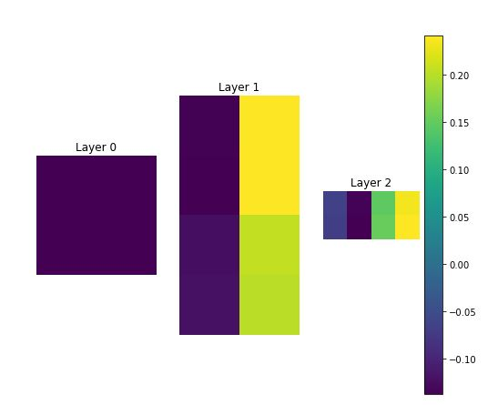

# Keras Functional API for Multiple Inputs and Outputs, Accessing Model Layers and Freezing Layers
- In this project, i explore the keras functional api by accomplishing three tasks concerned with customizing models.
- You can get the code in [tensorflow_multiple_inputs.ipynb](./tensorflow_multiple_inputs.ipynb)

## Multiple inputs and outputs
- After loading data on diagnosis of 2 types of diseases(inflammation, nephritis) based on 6 input features (temperature, nausea_occurence, lumbar_pain, urine_pushing, micturition_pains, bis), I built a model using the Keras Functional API that takes the 6 features as separate inputs and concatenates them to provide input for a dense layer with two outputs for predicting the two disease probability.
- The model is as follows:

- Loss and Accuracy plots: 

## Accessing model layers
- I first loaded a pre-trained model called vgg19
- Then, I built a model to access the layer outputs of vgg19 by using `vgg_model.input` and `vgg_model.layers`. To get the layers, i used list comprehension `layer_outputs = [layer.output for layer in vgg_layers]` in `features = Model(inputs= vgg_input, outputs = layer_outputs)`. 
- Using the following image:

- I visualized the input features which are R, G, B channels

- Next, i visualized the first layer features which are the 64 filters of the first Conv2D layer

- Finally, i visualized the 3rd conv2d block pooling layer features which has 256 filters

## Freezing layers
- I first built a simple model using the Sequential API with 3 Dense layers.
- I retrieved the weights and biases before training and after training so i can plot the difference or variation.
- Before freezing:

- After freezing the first layer and training the model again, I visualized the variation so that `layer 0` variation is dark since it was frozen and is not affected by the training. This means the weights and biases will stay the same, thus having 0 variance.

# Setup
- Create virtual environment:  `python -m venv venv`
- Activate virtual environment: `call venv/Scripts/activate.bat` in cmd
- Install dependencies: `pip install -r requirements.txt`

# Libraries
- Tensorflow
- Numpy
- Pandas
- scikit-learn
- ipykernel

## Contact
 - LinkedIn: [Natan Asrat](https://linkedin.com/in/natan-asrat)
 - Gmail: nathanyilmaasrat@gmail.com
 - Telegram: [Natan Asrat](https://t.me/fail_your_way_to_success)
 - Youtube: [Natville](https://www.youtube.com/@natvilletutor)

